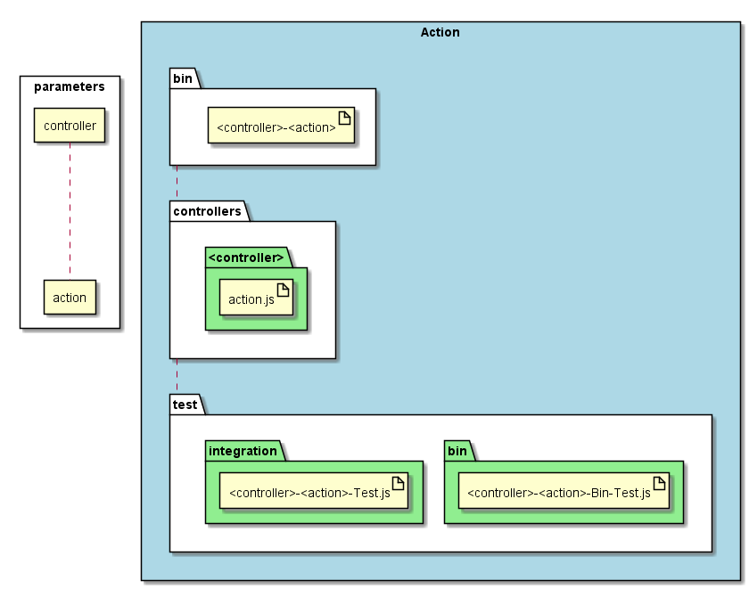

.. _SubSystem-Action:

Action
======

Action is a subsystem of bouquet that creates an action to the system.

Command Line Interface
----------------------

.. code-block:: none

  # sails generate bouquet-Action <controller> <action>

Generated Artifacts
-------------------

Directory layout for the Action type.

* bin

  * "<controller>-<action>"

* api

  * controllers

    * "<controller>"

      * "<action>.js"

* test

  * bin

    * "<controller>-<action>-Bin-Test.js"
    * "<controller>-<action-Test.js"

