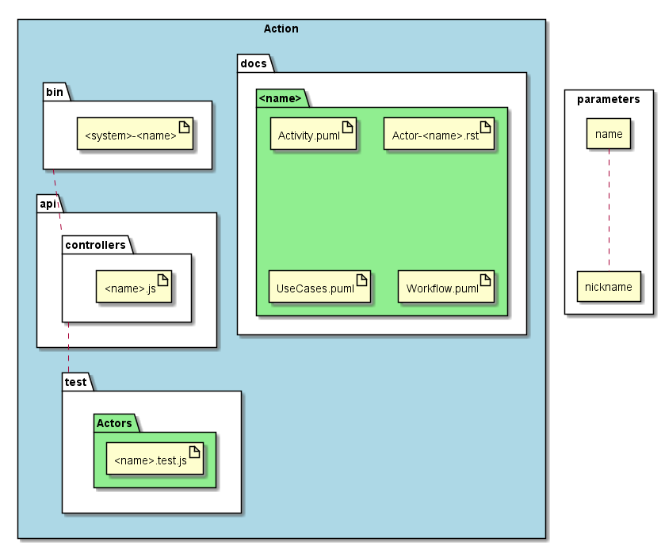

.. _SubSystem-Actor:

Actor
=====

Actor is a subsystem of bouquet that genreates artifacts for the actor of the system.

Command Line Interface
----------------------

Command line interface for the generation of the artifacts of the Actor

.. code-block:: none

  # sails generate bouquet-Actor <name> <name> <nickname>

Generated Artifacts
-------------------

Here is the directory of the generated artifacts.

* docs

  * Actors

    * <name>

      * Activity.puml
      * "Actor-<name>.rst"
      * UseCases.puml
      * Workflow.puml

* api

  * controllers

    * "<name>.js"

* bin

  * "<system>-<name>"

* test

  * Actors

    * "<name>.test.js"

