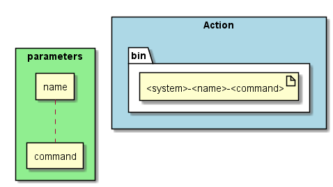

.. _SubSystem-Bin:

Bin
===

Bin is a subsystem of bouquet that genreates artifacts for a binary of the system.

Command Line Interface
----------------------

Command line interface for the generation of the artifacts of the Actor

.. code-block:: none

  # sails generate bouquet-Bin <name> <command>

Generated Artifacts
-------------------

Here is the directory of the generated artifacts.

* bin

  * "<system>-<name>-<command>"

