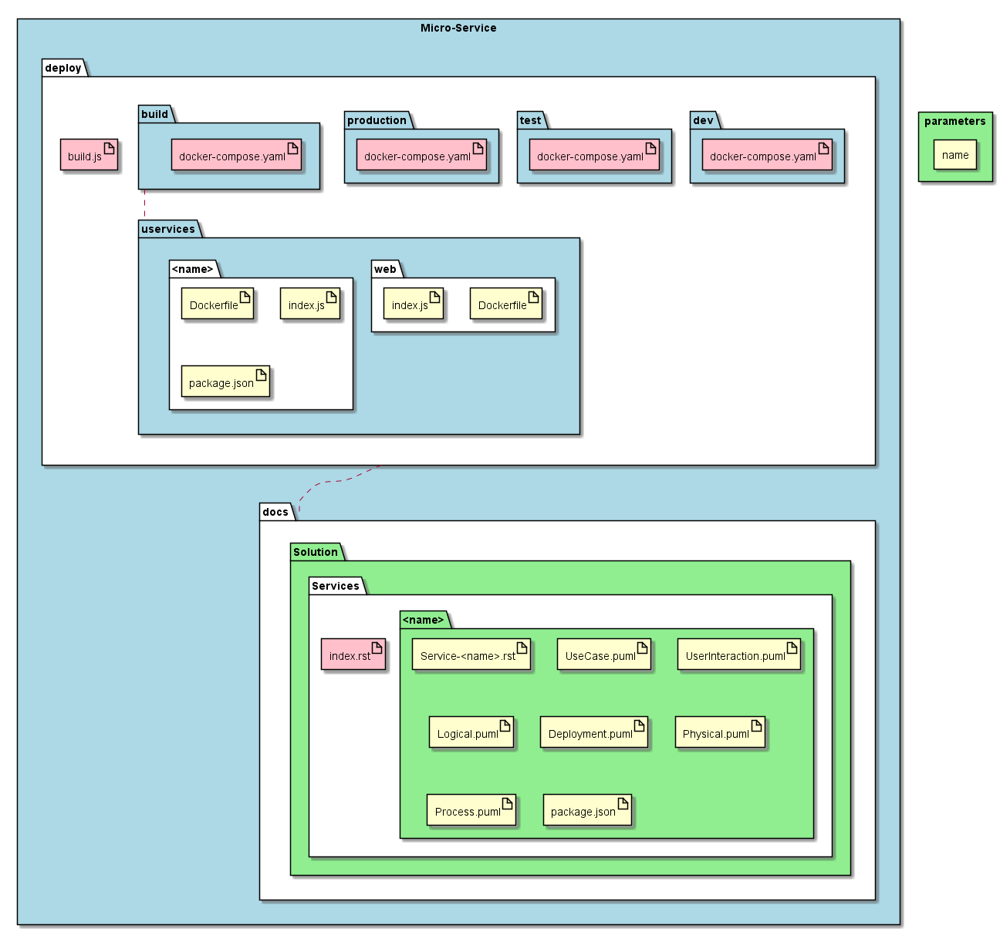

.. _SubSystem-Micro-Service:

Micro-Service
=============

Micro-Service represents a micro-service that is being developed to implement the system.
Bouquet helps with the implmentation and documentation of micro-services through re-usable templates in the sails
framework. These template combined with the conventions in the sails framework accelerates the design and deployment
of micro-services.

Generated Artifacts
-------------------
There are several artifacts that are generated when using bouquet for micro-service generation. The artifacts can be
grouped into two categories: deployable and documentation.

Deployment artifacts are used when deploying the application. They consist of deployment manifests for multiple
environments (dev, test, production). The deployment manifests show how all of the micro-services are deployed
and their relationships between them. In the current implementation the "Docker Compose" file format is used.

Additionally for each micro-service a directory is created. And three "starter" files are added to the directory.
The convention that I have chosen is Docker, and "micro" nodejs for the development and deployment of micro-services.
As a result a standard Dockerfile is created and a simple index.js file is created following standard micro examples.
Lastly a package.json file is created to help automate the building and deploying of the microservice.

For all of the micro services the following will be generateed once.

* docs

  * Solution

    * Services

      * index.rst

* deploy

  * build.js

  * dev

    * docker-compose.yaml

  * test

    * docker-compose.yaml

  * production

    * docker-compose.yaml

  * build

    docker-compose.yaml

  * uservices

    * web

      * Dockerfile
      * index.js
      * package.json

For each micro service the following will be generated.

* deploy

  * uservices

    * "<name>"

      * Dockerfile
      * index.js
      * package.json

* docs

  * Solution

    * Services

      * "<name>"

        * "Service-<name>.rst"
        * "UseCase.puml"
        * "UserInteraction.puml"
        * "Logical.puml"
        * "Deployment.puml"
        * "Physical.puml"
        * "Process.puml"
        * "package.json"

