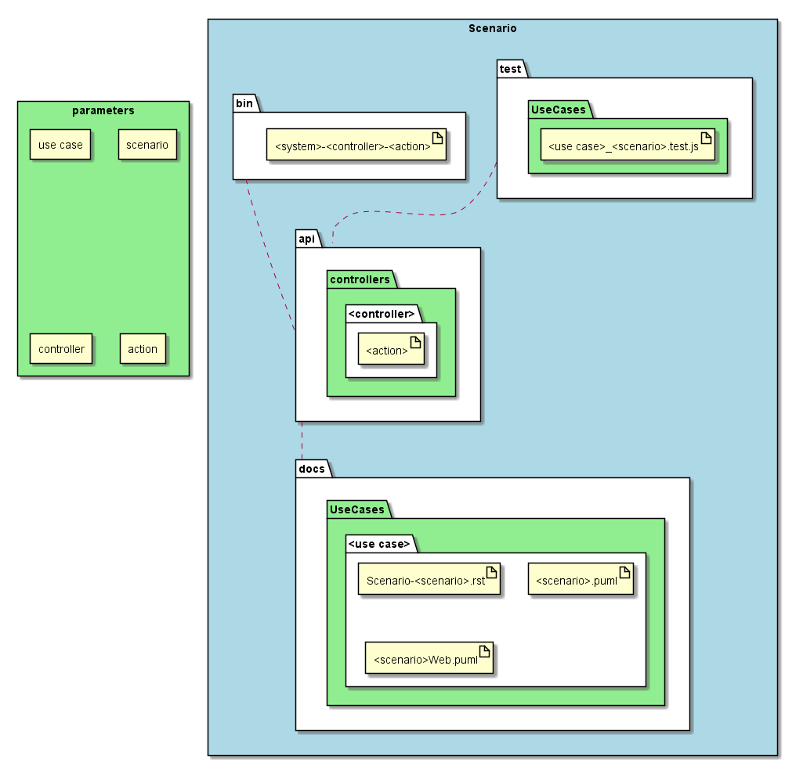

.. _SubSystem-Scenario:

Scenario
========

Scenario is a subsystem of bouquet that generates artifacts for the Scenario.

Command Line Interface
----------------------

.. code-block:: none

  # sails generate bouquet-Scenario <use case> <scenario name> <controller> <action>

Generated Artifacts
-------------------

* api

  * controllers

    * "<controller>"

      * "<action>"

* bin

  * "<system>-<controllers>-<action>"

* test

  * UseCases

    * "<use case>_<scenario name>.test.js"

* docs

  * UseCases

    * "<use case>"

      * "Scenario-<scenario name>.rst"
      * "<scenario name>.puml"
      * "<scenario name>Web.puml"

