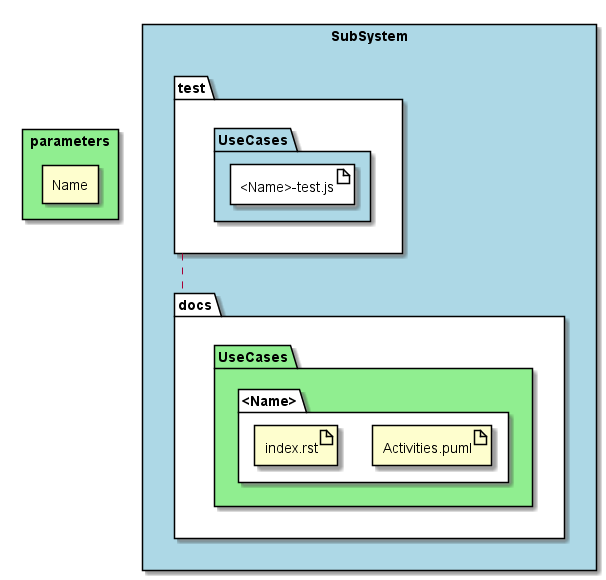

.. _SubSystem-SubSystem:

SubSystem
=========

SubSystem is a subsystem of bouquet pattern Generator that creates documentation and diagrams for the SubSystem.
It supports multiple layers of subsystems by nesting parameters to the command line interface.

Command Line Interface
----------------------

This can generate multiple levels of the SubSystem architecture.

.. code-block:: none

  # sails generate bouquet-SubSystem <Name> [Name2]...

Artifacts Generated
-------------------

* test

  * Solution

    * <SubSystem>.test.js

* docs

  * Solution

    * <Name>

      * index.rst
      * UseCases.puml
      * UserInteraction.puml
      * Logical.puml
      * Deployment.puml
      * Logical.puml
      * Physical.puml
      * Process.puml
      * <Name2>

          * index.rst
          * UseCases.puml
          * UserInteraction.puml
          * Logical.puml
          * Deployment.puml
          * Logical.puml
          * Physical.puml
          * Process.puml

