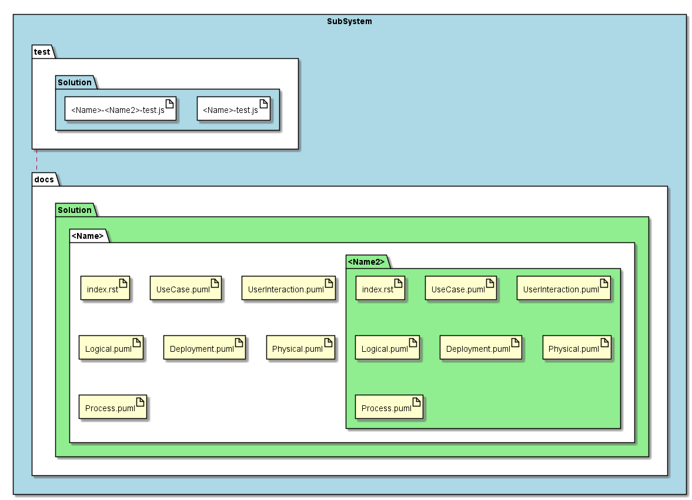

.. _SubSystem-UseCase:

UseCase
=======

UseCase is a subsystem of bouquet pattern generator.

Command Line Interface
----------------------

.. code-block:: none

  # sails generate bouquet-UseCase <Name>

Gnerated Artifacts
------------------

* docs

  * UseCases

    * <Name>

      * Activities.puml
      * index.rst

* test

  * UseCases

    * <Name>.test.js

